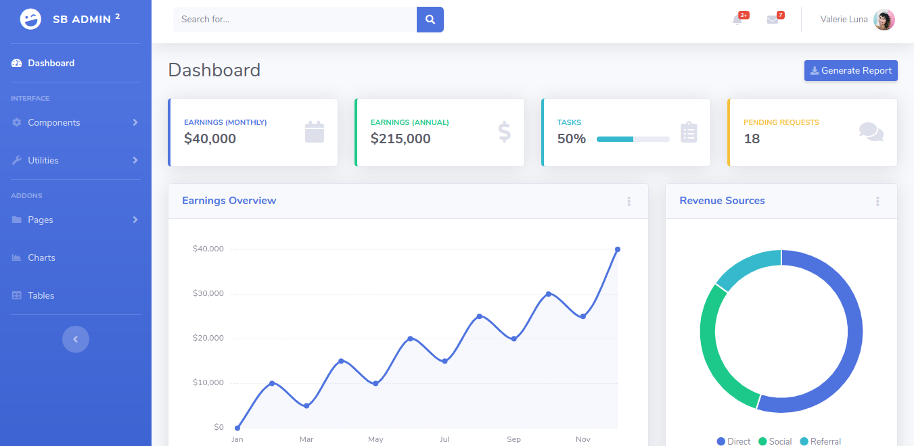

# [Flask Admin Boilerplate with SB Admin 2](https://flask-admin-boilerplate.herokuapp.com/)



This web application is built using the **[Python Flask Framework](https://palletsprojects.com/p/flask/)** and **[SB Admin 2 Theme (Free version)](https://startbootstrap.com/themes/sb-admin-2/)**

## Features

- MongoDB database
- Session-Based authentication (Login and Register)
- SMTP Integration
- Gunicorn Deployment script
- **MIT License**
- SB Admin 2 Dashboard Theme
- Illustration from [Undraw.co](https://undraw.co/)
- Support

## Getting Started

The hosted version of this web application is found [here](https://flask-admin-boilerplate.herokuapp.com)


### Prerequisites

- Python >= 3.5
- Pip, Virtualenv
- MongoDb Database
- SMTP Relay (Gmail, Sendgrid)

### Installing

Follow the steps below to install the application

```bash
$ git clone 
$ cd flask-admin-boilerplate
$
$ virtualenv env
$ source env/bin/activate
$ 
$ # Install requirements
$ pip install -r requirements.txt

```

### Make sure you configure the SMTP and Mongodb Database before running the application
Navigate to __init__.py under the configurations folder to configure your database and SMTP

### Running the application

After installing all the requirements and ensuring that the configurations are done correctly, run the app.

```bash
$ # Run the application
$ python app.py
```

## Deployment

This web application has the basic configuration for deployment with Gunicorn. Makes it easy for the application to be deployed on Heroku.

## Support

For support or pull requests and github issues you can reach me via email [bukunmiadewale3@gmail.com](mailto:bukunmiadewale3@gmail.com) or [me@bukunmiweb.site](mailto:me@bukunmiweb.site)

## Developer

**Oyelekan Bukunmi**  Find out more about me [here](https://www.bukunmiweb.site)


## License

This project is licensed under the MIT License

## Donation

[](https://www.paypal.com/cgi-bin/webscr?cmd=_s-xclick&hosted_button_id=TELRSZ8TJY5XE)


## Acknowledgement

* [Python Flask Framework](https://palletsprojects.com/p/flask/) - The web framework used
* [SB Admin 2 Theme (Free version)](https://startbootstrap.com/themes/sb-admin-2/) - The UI theme used